# LEMP Stack Implementation on AWS EC2

## 📋 Project Overview
This project documents the comprehensive step-by-step process of deploying a **LEMP (Linux, Nginx, MySQL, PHP)** stack on an AWS EC2 Ubuntu 20.04 server for the **StegHub Cloud-DevOps Bootcamp**.  

The LEMP stack consists of:
- **L**inux (Ubuntu 20.04) - Operating System
- **E**ngine-X (Nginx) - Web Server
- **M**ySQL - Database Management System
- **P**HP - Server-side scripting language

The implementation was verified by creating a dynamic PHP web application that connects to a MySQL database and displays data.

---

## 🚀 Detailed Implementation Steps

### Step 1: Installing Nginx Web Server

#### 1.1 Update Package Repository
First, update the server's package index to ensure we have the latest package information:

```bash
sudo apt update
```

#### 1.2 Install Nginx
Install the Nginx web server:

```bash
sudo apt install nginx -y
```

#### 1.3 Verify Nginx Installation
Check if Nginx is running and enabled:

```bash
sudo systemctl status nginx
```

#### 1.4 Configure Firewall (if UFW is enabled)
Allow HTTP and HTTPS traffic through the firewall:

```bash
sudo ufw allow 'Nginx Full'
```

#### 1.5 Test Nginx Installation
Verify that Nginx is serving the default page by accessing your EC2 public IP address in a web browser:

```
http://your-ec2-public-ip
```

You should see the "Welcome to nginx!" default page.

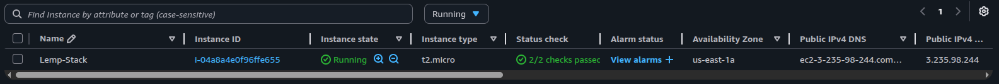

#### 1.6 Verify Nginx Status
Check that Nginx service is active and running:

```bash
sudo systemctl status nginx
```

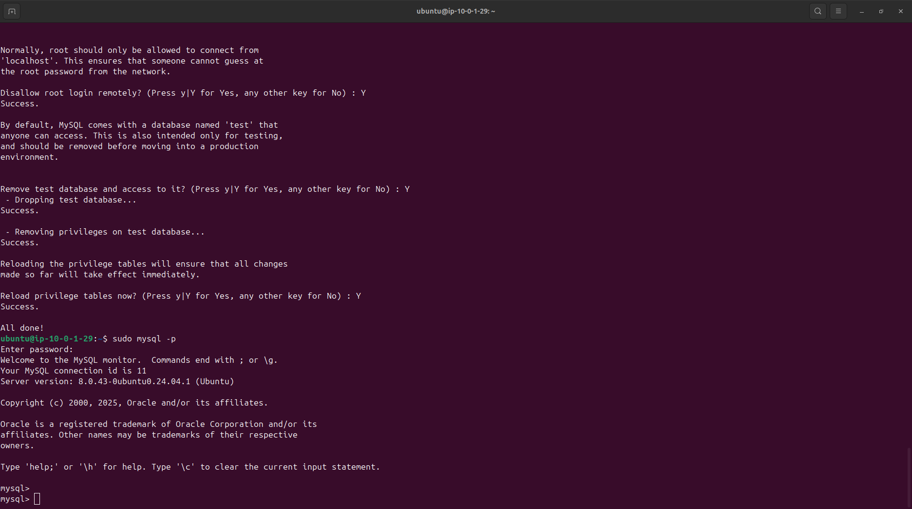

---

### Step 2: Installing MySQL Database Server

#### 2.1 Install MySQL Server
Install MySQL server package:

```bash
sudo apt install mysql-server -y
```

#### 2.2 Secure MySQL Installation
Run the security script to secure your MySQL installation:

```bash
sudo mysql_secure_installation
```

During this process:
- Set up password validation policy
- Set a strong root password
- Remove anonymous users
- Disable remote root login
- Remove test database
- Reload privilege tables

#### 2.3 Test MySQL Connection
Connect to MySQL as root:

```bash
sudo mysql -u root -p
```

#### 2.4 Create Database and User
Create a dedicated database and user for the application:

```sql
CREATE DATABASE example_database;
CREATE USER 'example_user'@'%' IDENTIFIED WITH mysql_native_password BY 'Lemp@2025!';
GRANT ALL ON example_database.* TO 'example_user'@'%';
FLUSH PRIVILEGES;
EXIT;
```

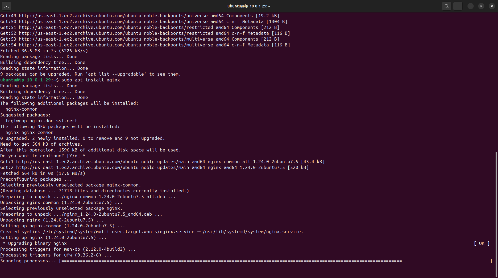

#### 2.5 MySQL Secure Installation Process
The security script will prompt for various security configurations:

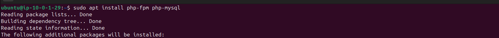

#### 2.6 MySQL User and Database Creation
After securing MySQL, create the application database and user:

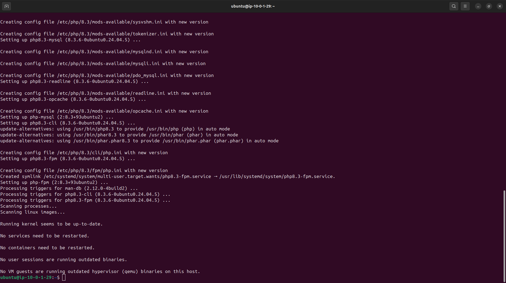

---

### Step 3: Installing PHP

#### 3.1 Install PHP and Required Extensions
Install PHP-FPM (FastCGI Process Manager) and PHP MySQL extension:

```bash
sudo apt install php-fpm php-mysql -y
```

#### 3.2 Verify PHP Installation
Check the installed PHP version:

```bash
php --version
```

#### 3.3 Check PHP-FPM Status
Ensure PHP-FPM service is running:

```bash
sudo systemctl status php7.4-fpm
```

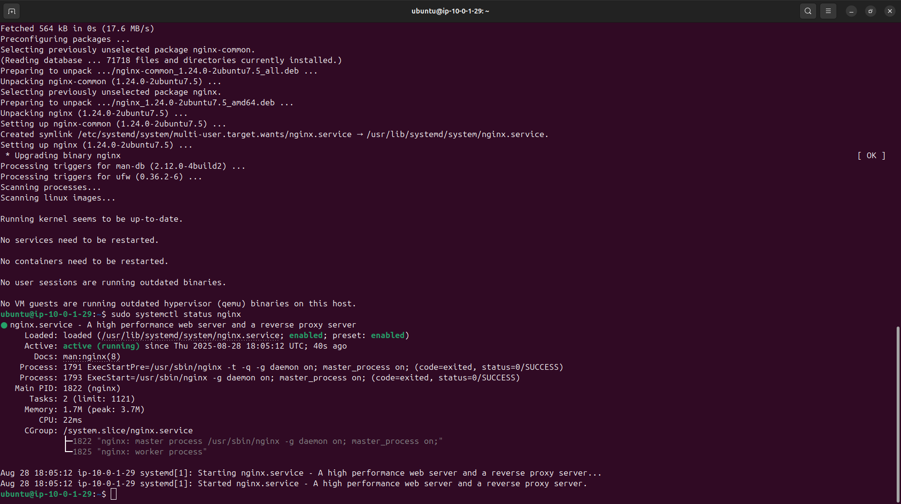

---

### Step 4: Configuring Nginx to Use PHP Processor

#### 4.1 Create Project Root Directory
Create a directory for your project:

```bash
sudo mkdir /var/www/projectLEMP
```

#### 4.2 Set Directory Ownership
Assign ownership to the current user:

```bash
sudo chown -R $USER:$USER /var/www/projectLEMP
```

#### 4.3 Create Nginx Server Block Configuration
Create a new server block configuration file:

```bash
sudo nano /etc/nginx/sites-available/projectLEMP
```

Add the following configuration:

```nginx
server {
    listen 80;
    server_name projectLEMP www.projectLEMP;
    root /var/www/projectLEMP;

    index index.html index.htm index.php;

    location / {
        try_files $uri $uri/ =404;
    }

    location ~ \.php$ {
        include snippets/fastcgi-php.conf;
        fastcgi_pass unix:/var/run/php/php7.4-fpm.sock;
    }

    location ~ /\.ht {
        deny all;
    }
}
```

#### 4.4 Enable the New Server Block
Create a symbolic link to enable the site:

```bash
sudo ln -s /etc/nginx/sites-available/projectLEMP /etc/nginx/sites-enabled/
```

#### 4.5 Test Nginx Configuration
Test the configuration for syntax errors:

```bash
sudo nginx -t
```

#### 4.6 Disable Default Nginx Site
Disable the default Nginx site:

```bash
sudo unlink /etc/nginx/sites-enabled/default
```

#### 4.7 Reload Nginx
Reload Nginx to apply changes:

```bash
sudo systemctl reload nginx
```

#### 4.8 Create Test HTML File
Create a simple HTML file to test the configuration:

```bash
echo 'Hello LEMP from hostname' $(curl -s http://169.254.169.254/latest/meta-data/public-hostname) 'with public IP' $(curl -s http://169.254.169.254/latest/meta-data/public-ipv4) > /var/www/projectLEMP/index.html
```

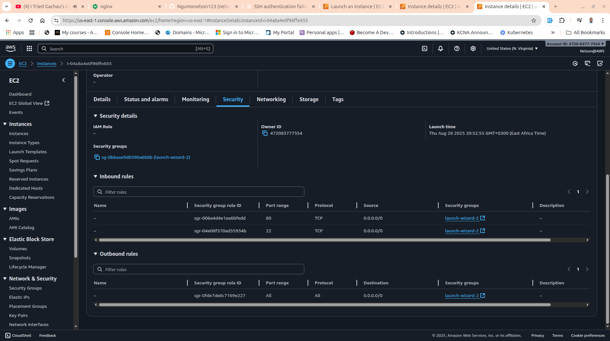

---

### Step 5: Testing PHP with Nginx

#### 5.1 Create PHP Info File
Create a PHP file to test PHP processing:

```bash
nano /var/www/projectLEMP/info.php
```

Add the following PHP code:

```php
<?php
phpinfo();
?>
```

#### 5.2 Test PHP Processing
Access the PHP info page in your web browser:

```
http://your-ec2-public-ip/info.php
```

You should see a detailed PHP information page showing:
- PHP version
- Server information
- Loaded extensions
- Configuration details

#### 5.3 Security Note
After testing, remove the info.php file as it contains sensitive information:

```bash
rm /var/www/projectLEMP/info.php
```

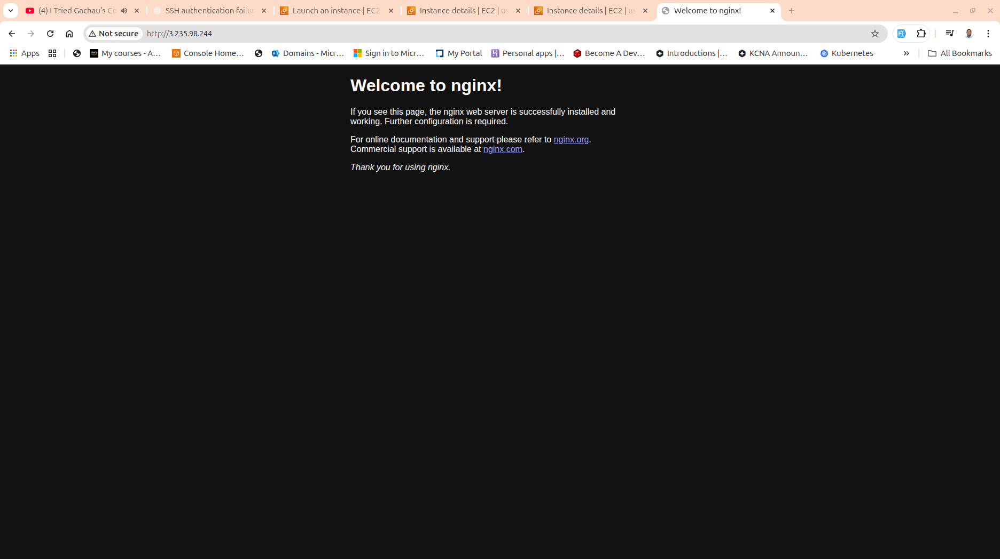

---

### Step 6: Creating and Configuring MySQL Database

#### 6.1 Connect to MySQL
Connect to MySQL using the created user:

```bash
mysql -u example_user -p
```

Enter the password: `Lemp@2025!`

#### 6.2 Select Database
Switch to the example_database:

```sql
USE example_database;
```

#### 6.3 Create Todo List Table
Create a table to store todo items:

```sql
CREATE TABLE todo_list (
    item_id INT AUTO_INCREMENT,
    content VARCHAR(255),
    PRIMARY KEY(item_id)
);
```

#### 6.4 Insert Sample Data
Add some sample todo items:

```sql
INSERT INTO todo_list (content) VALUES ("My first important item");
INSERT INTO todo_list (content) VALUES ("My second important item");
INSERT INTO todo_list (content) VALUES ("My third important item");
INSERT INTO todo_list (content) VALUES ("My LEMP stack important item");
```

#### 6.5 Verify Data Insertion
Query the table to confirm data was inserted:

```sql
SELECT * FROM todo_list;
```

#### 6.6 Exit MySQL
```sql
EXIT;
```

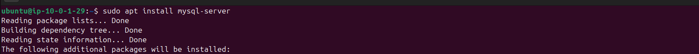

---

### Step 7: Creating PHP Application to Retrieve Data from MySQL

#### 7.1 Create PHP Application File
Create a PHP script that connects to MySQL and displays the todo list:

```bash
nano /var/www/projectLEMP/todo_list.php
```

#### 7.2 Add PHP Code
Add the following PHP code to connect to MySQL and display data:

```php
<?php
$user = "example_user";
$password = "Lemp@2025!";
$database = "example_database";
$table = "todo_list";

try {
    $db = new PDO("mysql:host=localhost;dbname=$database", $user, $password);
    echo "<h2>TODO</h2><ol>";
    foreach($db->query("SELECT content FROM $table") as $row) {
        echo "<li>" . $row['content'] . "</li>";
    }
    echo "</ol>";
} catch (PDOException $e) {
    print "Error!: " . $e->getMessage() . "<br/>";
    die();
}
?>
```

#### 7.3 Test the PHP Application
Access the todo list application in your web browser:

```
http://your-ec2-public-ip/todo_list.php
```

The page should display:
- A "TODO" heading
- An ordered list of all items from the database
- Proper HTML formatting

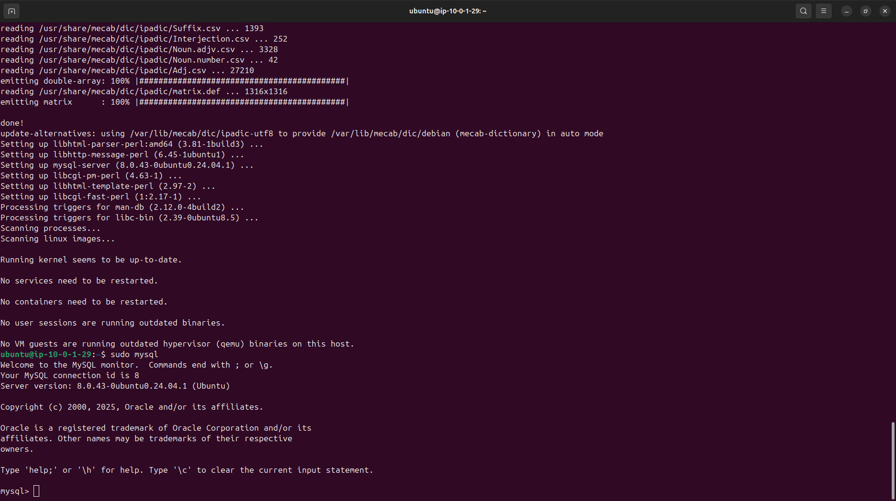

---

---

## ✅ Project Completion and Verification

### Final Testing
The LEMP stack implementation was successfully completed and verified through:

1. **Web Server Test**: Nginx serving static HTML content
2. **PHP Processing Test**: PHP info page displaying correctly
3. **Database Connectivity Test**: PHP successfully connecting to MySQL
4. **Dynamic Content Test**: PHP application retrieving and displaying database content

### Final Application Output
The todo list application demonstrates:
- **Frontend**: Clean HTML output with proper formatting
- **Backend**: PHP processing and database queries
- **Database**: MySQL storing and retrieving data
- **Web Server**: Nginx serving PHP content via FastCGI

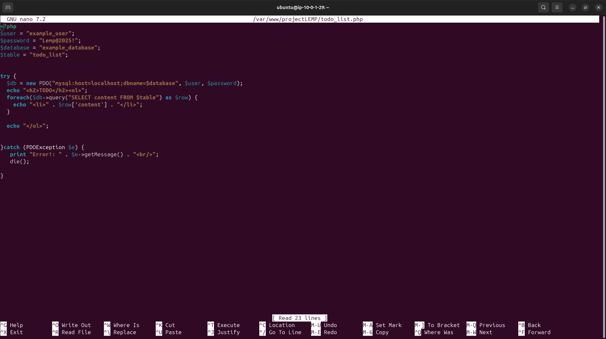

### Additional Implementation Screenshots
The following screenshots show additional steps and verifications performed during the implementation:

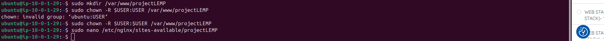

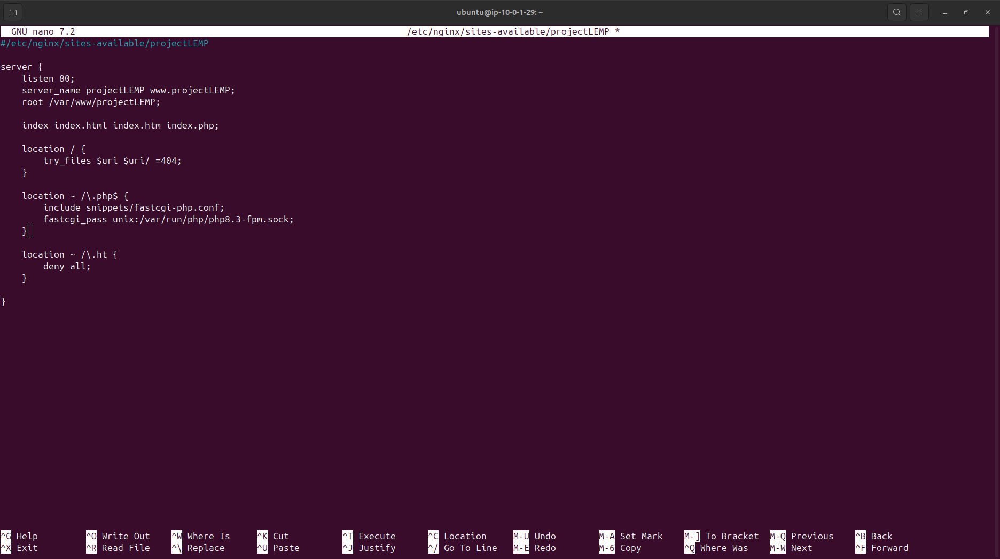


---

## 🏗️ Architecture Overview

```
┌─────────────────┐    ┌─────────────────┐    ┌─────────────────┐    ┌─────────────────┐
│   Web Browser   │───▶│      Nginx      │───▶│   PHP-FPM       │───▶│     MySQL       │
│   (Client)      │    │  (Web Server)   │    │ (PHP Processor) │    │   (Database)    │
└─────────────────┘    └─────────────────┘    └─────────────────┘    └─────────────────┘
```

---

## 🔧 Technical Specifications

| Component | Version/Details |
|-----------|----------------|
| **OS** | Ubuntu 20.04 LTS |
| **Web Server** | Nginx |
| **Database** | MySQL Server |
| **PHP** | PHP 7.4 with FPM |
| **Cloud Platform** | AWS EC2 |
| **Instance Type** | t2.micro (or similar) |

---

##  Key Learning Outcomes

### Technical Skills Acquired:
- **Linux System Administration**: Package management, service configuration
- **Web Server Configuration**: Nginx server blocks, FastCGI setup
- **Database Management**: MySQL installation, user management, database creation
- **PHP Development**: Server-side scripting, database connectivity
- **AWS Cloud Services**: EC2 instance management, security groups
- **DevOps Practices**: Infrastructure setup, service integration

### Best Practices Implemented:
- ✅ Secure MySQL installation with proper user privileges
- ✅ Nginx security configurations (deny .htaccess files)
- ✅ PHP-FPM for better performance and security
- ✅ Proper file permissions and ownership
- ✅ Firewall configuration for web traffic
- ✅ Removal of sensitive test files (info.php)

---

## 🚀 Next Steps and Improvements

### Potential Enhancements:
1. **SSL/TLS Configuration**: Implement HTTPS with Let's Encrypt
2. **Database Security**: Enable SSL for MySQL connections
3. **Performance Optimization**: Configure Nginx caching, PHP OPcache
4. **Monitoring**: Set up logging and monitoring solutions
5. **Backup Strategy**: Implement automated database backups
6. **Load Balancing**: Configure multiple PHP-FPM workers

---

## 📋 Project Checklist

- [x] AWS EC2 instance launched and configured
- [x] Nginx web server installed and running
- [x] MySQL database server installed and secured
- [x] PHP and PHP-FPM installed and configured
- [x] Nginx configured to process PHP files
- [x] Database and user created with proper permissions
- [x] Sample data inserted into database
- [x] PHP application created and tested
- [x] Full stack integration verified
- [x] Documentation completed with screenshots

---

## 📝 Author
**Nelson Ngumo**  
*StegHub Cloud-DevOps Bootcamp Student*  
DevOps & Cloud Engineer | AWS | Kubernetes | Terraform | CI/CD

---

## 📄 Project Repository
This project is part of the **StegHub Cloud-DevOps Bootcamp** curriculum, demonstrating practical implementation of web application infrastructure on AWS cloud platform.  